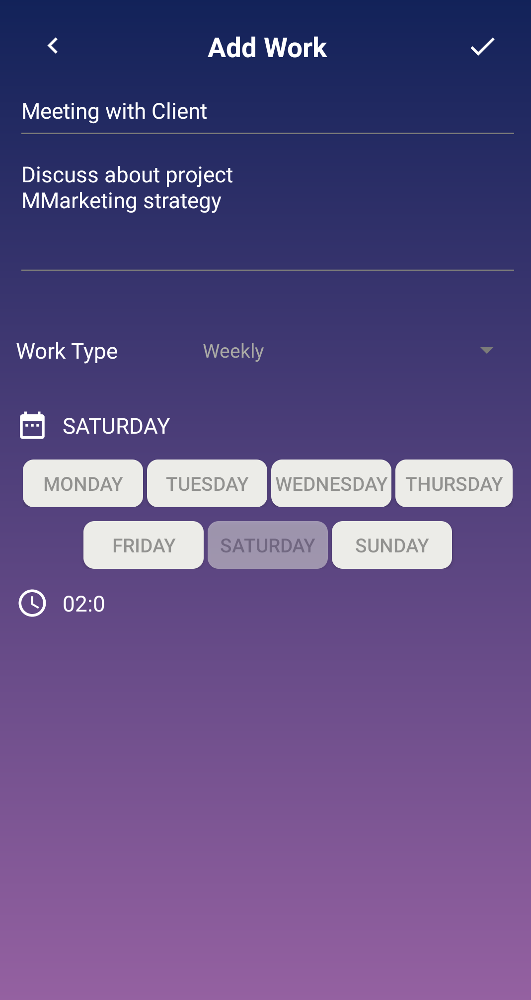
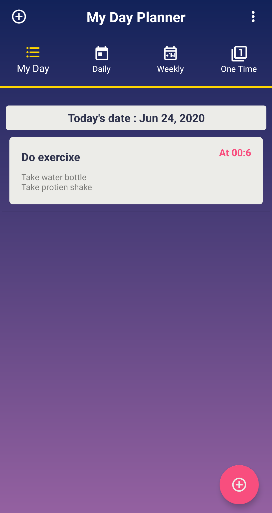
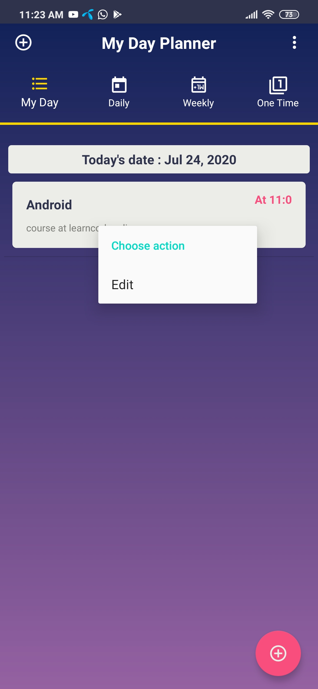

# DayPlanner
Its a Day Planner App that lets user to create tasks for his daily routine. User can create daily, weekely and one time reminder tasks.

### SQL
This app has was developed on Android Studio using SQLite as database.

## Alarm and Notifications
Alarm manager serves the duty of notifying user about thier schedule work.

## Add Weekely Work 

## Viewing Work schedule 
  

## Edit Work
A longClicklistener() has been implemented on recyler view which displays a menu to edit the work.

## Delete Work
Swipe to delete functionality has been used on recyclyer view , allowing user to perform deletion.

