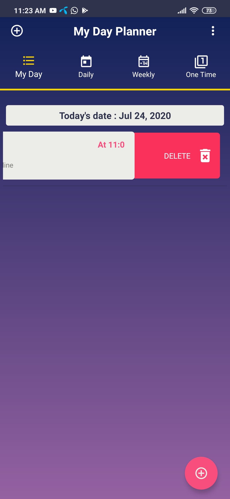

# DayPlanner
This app is a simple TODO Planner app. User can schedule work and app reminds user by notifying at particular time.

### SQL
This app has been developed using SQLHELPER for android.

## Alarm and Notifications
Alarm manager serves the duty of notifying user about thier schedule work.

## Add Weekely Work 

## Viewing Daily schedule 

## Edit Work
A longClicklistener() has been implemented on recyler view which displays a menu to edit the work.

## Delete Work
Swipe to delete functionality has been used on recyclyer view , allowing user to perform deletion.

